# Image-Recovery-Using-Conditional-Adversarial-Networks
Analyzing Conditional Adversarial Networks to solve image recovery problems like shadow recovery, denoising and deblurring.

### Requistites:
1. Python 3
2. Pytorch 
3. MATLAB

### Dataset 

ISTD Dataset is used.
Link to [Google Drive](https://drive.google.com/file/d/1I0qw-65KBA6np8vIZzO6oeiOvcDBttAY/view)

### Image Recovery Objectives 

Recovery is tested for the following augmented sets of images created from ISTD dataset.

1. Only Shadow
2. Shadow + Salt and Pepper Noise
3. Shadow + Speckle Noise
4. Shadow + Gaussian Noise
5. Shadow + All Noises
6. Shadow+ BLur
7. Shadow + Salt and Pepper Noise + Blur
8. Shadow + Speckle Noise + Blur
9. Shadow+ Gaussian Noise + Blur
10. Shadow + All Noises + Blur

### Creating Dataset

Run <code> generate.m </code> to generate the extra augmented images to help the network train to restore images that are degraded by more than one type of artifact.

<code>python dataset_create.py </code> to resize the input and GT images such that they are in the proper format to be fed in to the network.

Addition of any more type of images afflicted with artifacts would be fruitful and would improve the network's performance.

Make a dataset folder and store the augmented images generated from dataset_create.py in it.

### Conditional Adversarial Networks

We have used the pix2pix network proposed for image to image translation tasks by [Jun-Yan Zhu](https://github.com/junyanz) for this work.

**Pix2pix:  [Project](https://phillipi.github.io/pix2pix/) |  [Paper](https://arxiv.org/pdf/1611.07004.pdf) |  [Torch](https://github.com/phillipi/pix2pix)**

### Running the Code :

To train the model :
<code> python train.py --dataroot ./datasets/shadow --name shadow_pix2pix --model pix2pix --direction BtoA </code>

To test the model:
<code> python test.py --dataroot ./datasets/shadow --name shadow_pix2pix --model pix2pix --direction BtoA </code>

To view the results:
<code> ./results/facades_pix2pix/test_latest/index.html </code>

### Results

From Left :

i)Input 

ii)Prediction

iii) Ground Truth

#### Samples:

  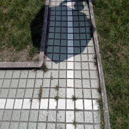
  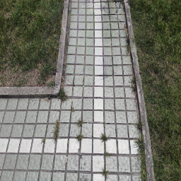
  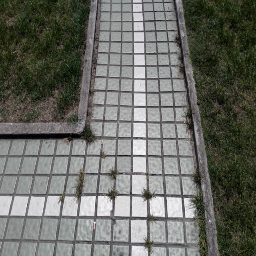

  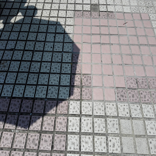
  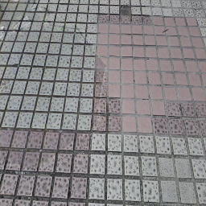
  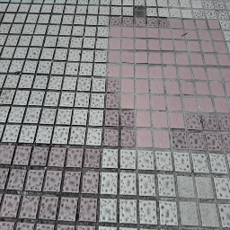

#### Shadow + Salt and Pepper Noise:

  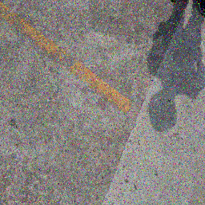
  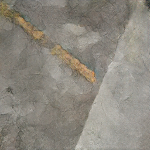
  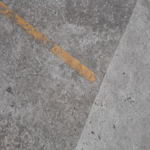

  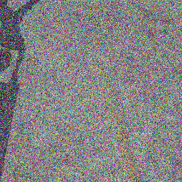
  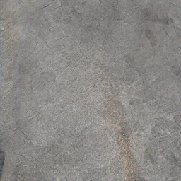
  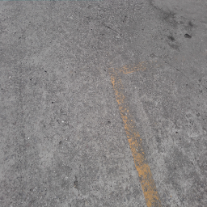

####  Shadow + Speckle Noise

  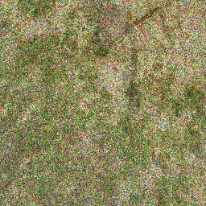
  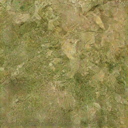
  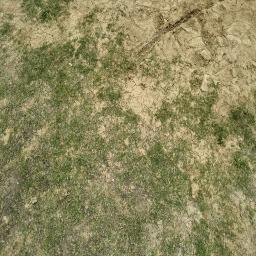

  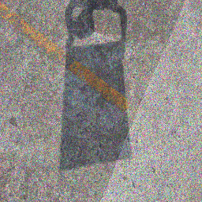
  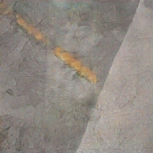
  

